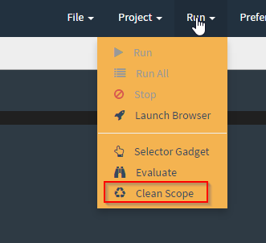

<h1> Minium Developer </h1>

# Create a new project

* Go to `Project > Create Project`
* Select the type of project that you want to create
* Fill the form
* Click on `Create`

The following types of project are available:

## Automator

Creates a simple project to automate tasks using Minium.

## Cucumber

Creates a base project, with a feature and his step definitions ready to
execute.

After the project creation you will see the project open in the sidebar.

# Open Project

If you already have a project in your filesystem you can open it.

* Go to `Project > Open Project`
* Fill the location of your project in the filesytem.


# Launch a webdriver

You can create new webdrivers where you will execute your tests or run your
code.

* Go to `Run > Launch Browser`
* Select the desired browser type
* Click on the button `Create a new webdriver`

## Internet Explorer Configuration

[In order to run tests on IE, you need to change some configurations](https://github.com/SeleniumHQ/selenium/wiki/InternetExplorerDriver#required-configuration):

* On IE 7 or higher on Windows Vista or Windows 7, you must set the Protected Mode settings for each zone to be the same value. The value can be on or off, as long as it is the same for every zone. To set the Protected Mode settings, choose "Internet Options..." from the Tools menu, and click on the Security tab. For each zone, there will be a check box at the bottom of the tab labeled "Enable Protected Mode".
* Additionally, "Enhanced Protected Mode" must be disabled for IE 10 and higher. This option is found in the Advanced tab of the Internet Options dialog.
The browser zoom level must be set to 100% so that the native mouse events can be set to the correct coordinates.
* For IE 11 only, you will need to set a registry entry on the target computer so that the driver can maintain a connection to the instance of Internet Explorer it creates. For 32-bit Windows installations, the key you must examine in the registry editor is `HKEY_LOCAL_MACHINE\SOFTWARE\Microsoft\Internet Explorer\Main\FeatureControl\FEATURE_BFCACHE`. For 64-bit Windows installations, the key is `HKEY_LOCAL_MACHINE\SOFTWARE\Wow6432Node\Microsoft\Internet Explorer\Main\FeatureControl\FEATURE_BFCACHE`. Please note that the `FEATURE_BFCACHE` subkey may or may not be present, and should be created if it is not present. Important: Inside this key, create a DWORD value named `iexplore.exe` with the value of 0.

## Firefox issues

You may experience some issues with the Firefox WebDriver. If that happens, [updating the WebDrivers](#update-webdrivers) might solve the problem.

# WebDriver customization

You can customize the drivers through the `application-OS.yml` file (where `OS` is `windows`, `linux` or `macos`) located in the `config` folder.

## Chrome

The Chrome WebDriver can be configured through the `chromeOptions` property. The following configurations are available:

* Add additional command line arguments to be used when starting Chrome.
* Set the path to the Chrome executable.
* Add Chrome extensions to install on browser startup.
* Set Chrome preferences.

Example:
```
minium:
  developer:
    webdrivers:
      - name: chrome
        displayName: Chrome
        iconClass: icon-chrome
        desiredCapabilities:
          browserName: chrome
        chromeOptions:
          args:
            - user-data-dir=/path/to/your/custom/profile
            - start-maximized
          binary: /path/to/other/chrome/binary
          extensions:
            - /path/to/extension.crx
          preferences:
            profile.default_content_settings.popups: 0
```

## Firefox

The Firefox WebDriver can be configured through the `firefox_profile` property. The following configurations are available:

* Load a profile from a directory
* Add extensions
* Set preferences: enable native events, load the focus library on Linux, accept untrusted SSL certificates
* Set any additional preference

Example:
```
minium:
  developer:
    webdrivers:
      - name: firefox-with-profile
        displayName: Firefox Profile
        iconClass: icon-firefox
        desiredCapabilities:
          browserName: firefox
        firefox_profile:
          dir: C:\Users\minium\AppData\Roaming\Mozilla\Firefox\Profiles\xxxxxxxx.<profile-name>
          extensions:
            - name: Some Extension
              path: C:\Users\minium\AppData\Roaming\Mozilla\Extensions\extension.xpi
          enableNativeEvents: true
          loadNoFocusLib: false
          acceptUntrustedCerts: true
          untrustedCertIssuer: false
          preferences:
            - name: accessibility.accesskeycausesactivation
              type: boolean
              value: true
```

# Status Button

The floating button in the bottom right corner give you feedback when the test
is being executed.

## Report

After an execution of a feature or a scenario you can see a button with a
tooltip "Report".

It will open a modal with the report of your last test execution. There you can
see the number of steps executed and if your test fails or some step was
skipped, it give you more details about what happened.

## Cancel test

You have the possibility of cancel a test execution.

## Clear markers

Clean the markers in the present editor.

# Console tab

Minium Developer provides you a console where you can put javascript expressions
that you don't want to put in your test files:


 It works like a helper for your
javascript code, you can evaluate expressions and select elements.

# Features

## Run tests (`Ctrl + Enter`)

Execute you the scenario from the cursor location. If you put the cursor in a
scenario it and you can also use a shortcut (`Ctrl + enter`) to run a specific
scenario.

## Run All

Execute all the scenario of your feature.

## Execution

When you run a scenario, Minium Developer will provide you a real time feedback
of the step results. Each step executed will be marked on editor with a color
depending on the result of the step. If the step is marked with red it means
that the step doesn't pass with success.

## Selector Gadget (`Ctrl + Shift + C`)

You can select an element or multiple elements in the webdriver. After the
selection it will automatically generate a CSS expression to find the elements
that you select.

You can use this to pick elements of a web page without looking to the source
code.

## Evaluate (`Ctrl + Enter`)

You can evaluate your expressions in javascript. For example, if you want to
evaluate an element like `$("#my-div")`, `var x = 10`. Evaluated variables will
be stored in a scope.

## Variables scope

When we evaluate some javascript in Minium Developer, all variables declared
we'll be maintained in the evaluation global scope. That means that, the next
time you evaluate something, all previously declared variables are still
available.

For instance, evaluate the following code:

```javascript
var name = "World";
```

Now you can evaluate the following code:

```javascript
"Hello " + name // it evaluate into "Hello world"
```

If you want to clear the global scope, so that all variables are removed from
it, you can do it by clicking in `Run > Clean scope`:



After that, if you try to run the previous code, it will fail:

```javascript
"Hello " + name // ReferenceError: "name" is not defined
```

## Search file (`Ctrl + P`)

Search and open files

# Update WebDrivers

To update the WebDrivers go to `Preferences > Download webdrivers > Update webdrivers`:


# Update Minium Developer to the latest release

1. Download the latest release from <https://github.com/viltgroup/minium-developer/releases/>.
2. Update the version of `minium-cucumber-parent` in the `pom.xml` file of your Minium projects. For instance, if you downloaded release 1.3.0, then you would need to change the file to something like:
```
<?xml version="1.0" encoding="UTF-8"?>
<project xmlns="http://maven.apache.org/POM/4.0.0" xmlns:xsi="http://www.w3.org/2001/XMLSchema-instance"
        xsi:schemaLocation="http://maven.apache.org/POM/4.0.0 http://maven.apache.org/xsd/maven-4.0.0.xsd">

        <modelVersion>4.0.0</modelVersion>

        <parent>
                <groupId>io.vilt.minium</groupId>
                <artifactId>minium-cucumber-parent</artifactId>
                <version>1.3.0</version>
                <relativePath />
        </parent>

        <groupId>your-project-groupId</groupId>
        <artifactId>your-project-artifactId</artifactId>
        <version>your-project-version</version>
</project>
```

# Run Minium Developer in the browser

To run Minium Developer in the browser, run the executable from the console and pass it the `--browser` option. After that, Minium Developer should open [http://localhost:8089/#/editor](http://localhost:8089/#/editor) in your default browser.

# Run Minium scripts

<h2>Usage</h2>

```bash
minium-developer automate [options...] arguments...
```

<h2>Options</h2>

| Option                   | Description
| ------------------------ | ----------------------------------------------
| `-b (--browser) BROWSER` | browser where scripts will be executed against                           (supported values: `chrome`, `ie`, `firefox`, `safari`, `opera`, `phantomjs`)
| `-f (--file) FILE`      | script file to run
| `-h (--help)`           | display this help and exit
| `-v (--version)`        | show version

<h2>Arguments</h2>

| Description |
| ---------------------------------------------- |
| script instructions to run. if `--file` or `--dir` is passed, SCRIPT is always executed before, so you can set variables for script file execution |

<h2>Examples</h2>

```bash
minium-developer automate --browser chrome --file main.js "user = { name : 'auser', password : 'apassword' }"
```

```
minium-developer automate --browser firefox --dir minium-task
```
