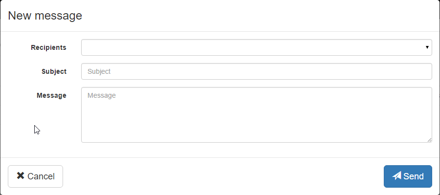

# Minium Automator

## Usage

```bash
minium-automator [options...] arguments...
```

## Options

| Option                   | Description
| ------------------------ | ----------------------------------------------
| `-b (--browser) BROWSER` | browser where scripts will be executed against                           (supported values: `chrome`, `ie`, `firefox`, `safari`, `opera`, `phantomjs`)
| `-f (--file) FILE`      | script file to run
| `-h (--help)`           | display this help and exit
| `-v (--version)`        | show version

## Arguments

| Description |
| ---------------------------------------------- |
| script instructions to run. if `--file` or `--dir` is passed, SCRIPT is always executed before, so you can set variables for script file execution |

## Examples

```bash
minium-automator --browser chrome --file main.js "user = { name : 'auser', password : 'apassword' }"
```

```
minium-automator --browser firefox --dir minium-task
```

# Automator Quickstart Guide


In this section we will walk you through on how to automate a task using a real-world example.

We'll be using a Sample App that was originally forked from the folks over at flightjs. The application is available for you to test in [http://minium.vilt.io/sampleApp/](http://minium.vilt.io/sampleApp/)

If you just want to jump straight to the finished project you can check the complete source code in [https://github.com/viltgroup/sample-app-e2e-tests](https://github.com/viltgroup/sample-app-e2e-tests)

## Writing the first automated task

This task consists in sending a simple email. The workflow to perform this task is the following:

1. **Go to** the page
2. **Click** on New button
3. **Fill** the recipient field
4. **Fill** the subject field
5. **Fill** the message field
6. **Click** on Send button

In the figure below we can see the the form that we want to fill.



With Minium, we can automate the tasks described above.

First of all we get all the elements that we want to interact, after that we do the necessary interactions to perform the task.


```javascript
// get elements
var newBtn = $("button").withText("New");
var sendBtn = $("button").withText("Send");
var toFld = $("#recipient_select");
var subjectFld = $("#compose_subject");
var messageFld = $("#compose_message");

// interactions
browser.get("http://minium.vilt.io/sampleApp/"); 	  // 1. Go to the page
newBtn.click();									 	  // 2. Click on New button
toFld.select("Rui Figueira");				     	  // 3. Fill the recipient field
subjectFld.fill("Automatic email");				 	  // 4. Fill the subject field
messageFld.fill("This email was sent automatically"); // 5. Fill the message field
sendBtn.click();									  // 6. Click on Send button
```

You can check the complete source code for this example in   [https://github.com/viltgroup/sample-app-e2e-tests/blob/master/src/test/resources/modules/simple.email.automator.js](https://github.com/viltgroup/sample-app-e2e-tests/blob/master/src/test/resources/modules/simple.email.automator.js)


## More complex automated tasks


In this particular example, we will automate the sending of multiple emails.

<h3> 1. Creating data for the emails </h3>

First of all we need to create the data for the emails.

```javascript
// list of the emails that we want to send
var emails = [{
    "To": "Rui Figueira",
    "Subject": "Minium Execution report for sample-app",
    "Message": "All tests passed with success !"
}, {
    "To": "Raphael Rodrigues",
    "Subject": "Minium Execution report for sample-app",
    "Message": "All tests passed with success !"
}, {
    "To": "Mario Lameiras",
    "Subject": "Minium Execution report for sample-app",
    "Message": "All tests passed with success !"
}];
```

<h3> 2. Creating a base expression to load with modals and loadings </h3>
```javascript
// creating a base expression
// This base expression always returns the scope we're working on: The main window unless a modal is visible and a loding is visible
var loading = $(".loading").withCss("display", "block");
var base = $(":root").unless(".modal:visible").add(".modal:visible").unless(loading);
```
<h3> 3. Creating a function to fill the new email form </h3>


```javascript
// auxiliar function to fill the new email form
function fillFormEmail(email) {

	//find the elements of the form
    var inputs = base.find("input, select, [contenteditable]");

    // iterate over each property of the email object
    // Example: email = { "To": "some to","Subject": "Some subject","Message": "some message"}
    for (var prop in email) {
        var val = email[prop];
        var colName = prop;

        // find the element by the attribute "data-placeholder"
        var fieldInput = inputs.withAttr("data-placeholder", colName);

        if (fieldInput.is("select")) {

        	//if the element is a select box
            fieldInput.select(val);
        } else {

        	//if the element is a textbox
            fieldInput.fill(val);
        }
    }
}
```


<h3> 4. Creating the function to send emails </h3>

Now that we got the function to fill the form email, we can simply iterate over each email, fill the form with the data of the email and click on the button to send it.

```javascript
// function that will send the emails
(function sendEmails() {
    // go to the page
    browser.get(config.baseUrl);

    // iterate over each email
    emails.forEach(function(email) {

    	//click on New button
        base.find("button").withText("New").click();

        //fill the new email form
        fillFormEmail(email);

        //click on button Send
        base.find("button").withText("Send").click();
    });

})();
```

You can check the complete source code for this example in   [https://github.com/viltgroup/sample-app-e2e-tests/blob/master/src/test/resources/modules/email.automator.js](https://github.com/viltgroup/sample-app-e2e-tests/blob/master/src/test/resources/modules/email.automator.js)
