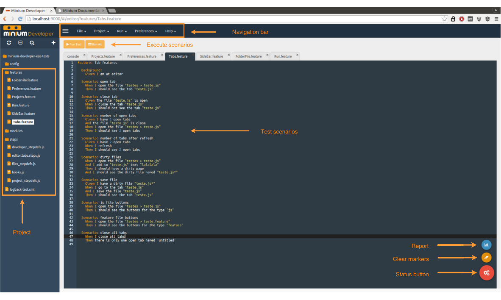
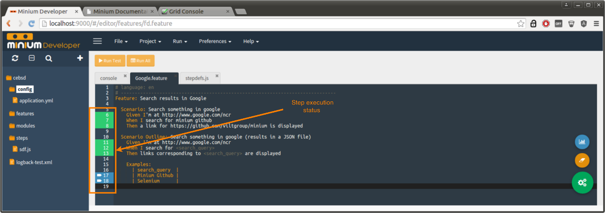
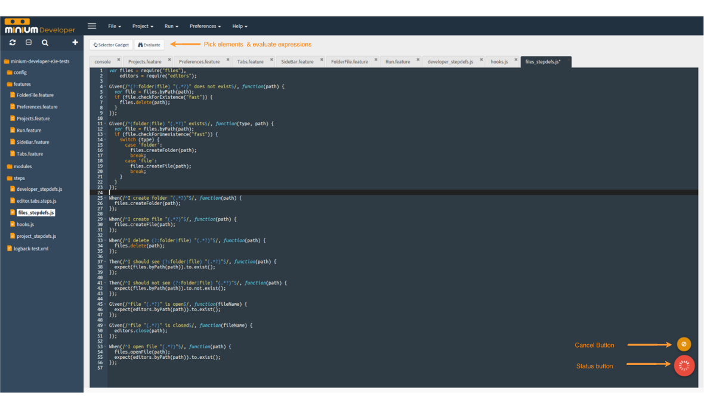

# Minium Developer

## Create a new project

* Go to `Project > Create Project`
* Select the type of project that you want to create
* Fill the form
* Click on `Create`

The following types of project are available:

### Automator

Creates a simple project to automate tasks using Minium.

### Cucumber

Creates a base project, with a feature and his step definitions ready to
execute.

After the project creation you will see the project open in the sidebar.

## Open Project

If you already have a project in your filesystem you can open it.

* Go to `Project > Open Project`
* Fill the location of your project in the filesytem.





## Launch a webdriver

You can create new webdrivers where you will execute your tests or run your
code.

* Go to `Run > Launch Browser`
* Select the desired browser type
* Click on the button `Create a new webdriver`

### Configure the Firefox WebDriver with a custom profile

You can configure the Firefox WebDriver with a custom profile by creating a file with name `application-dev.yml` in the folder `minium-tools/config` of your Minium installation directory. Configurations available:
* Load a profile from a directory
* Add extensions
* Set preferences: enable native events, load the focus library on Linux, accept untrusted SSL certificates
* Set any additional preference

Example:
```
minium:
  developer:
    webdrivers:
      - name: firefox-with-profile
        displayName: Firefox Profile
        iconClass: icon-firefox
        desiredCapabilities:
          browserName: firefox
        firefox_profile:
          dir: C:\Users\minium\AppData\Roaming\Mozilla\Firefox\Profiles\xxxxxxxx.<profile-name>
          extensions:
            - name: Some Extension
              path: C:\Users\minium\AppData\Roaming\Mozilla\Extensions\extension.xpi
          enableNativeEvents: true
          loadNoFocusLib: false
          acceptUntrustedCerts: true
          untrustedCertIssuer: false
          preferences:
            - name: accessibility.accesskeycausesactivation
              type: boolean
              value: true
    (other WebDrivers)
```

## Status Button

The floating button in the bottom right corner give you feedback when the test
is being executed.

### Report

After an execution of a feature or a scenario you can see a button with a
tooltip "Report".

It will open a modal with the report of your last test execution. There you can
see the number of steps executed and if your test fails or some step was
skipped, it give you more details about what happened.

### Cancel test

You have the possibility of cancel a test execution.

### Clear markers

Clean the markers in the present editor.

## Console tab

Minium Developer provides you a console where you can put javascript expressions
that you don't want to put in your test files. It works like a helper for your
javascript code, you can evaluate expressions and select elements.

## Features

### Run tests (`Ctrl + Enter`)

Execute you the scenario from the cursor location. If you put the cursor in a
scenario it and you can also use a shortcut (`Ctrl + enter`) to run a specific
scenario.

### Run All

Execute all the scenario of your feature.

### Execution

When you run a scenario, Minium Developer will provide you a real time feedback
of the step results. Each step executed will be marked on editor with a color
depending on the result of the step. If the step is marked with red it means
that the step doesn't pass with success.

### Selector Gadget (`Ctrl + Shift + C`)

You can select an element or multiple elements in the webdriver. After the
selection it will automatically generate a CSS expression to find the elements
that you select.

You can use this to pick elements of a web page without looking to the source
code.

### Evaluate (`Ctrl + Enter`)

You can evaluate your expressions in javascript. For example, if you want to
evaluate an element like `$("#my-div")`, `var x = 10`. Evaluated variables will
be stored in a scope.

### Search file (`Ctrl + P`)

Search and open files

## Update Minium Tools to the latest release

1. Download the latest release from <https://github.com/viltgroup/minium-tools/releases/>.
2. Update the version of `minium-cucumber-parent` in the `pom.xml` file of your Minium projects. For instance, if you downloaded release 1.3.0, then you would need to change the file to something like:
```
<?xml version="1.0" encoding="UTF-8"?>
<project xmlns="http://maven.apache.org/POM/4.0.0" xmlns:xsi="http://www.w3.org/2001/XMLSchema-instance"
        xsi:schemaLocation="http://maven.apache.org/POM/4.0.0 http://maven.apache.org/xsd/maven-4.0.0.xsd">

        <modelVersion>4.0.0</modelVersion>

        <parent>
                <groupId>io.vilt.minium</groupId>
                <artifactId>minium-cucumber-parent</artifactId>
                <version>1.3.0</version>
                <relativePath />
        </parent>

        <groupId>your-project-groupId</groupId>
        <artifactId>your-project-artifactId</artifactId>
        <version>your-project-version</version>
</project>
```
